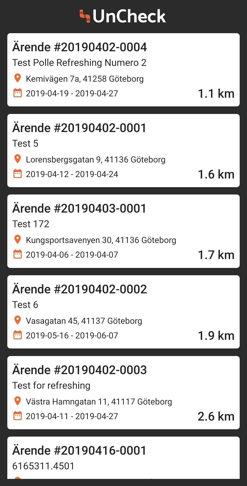
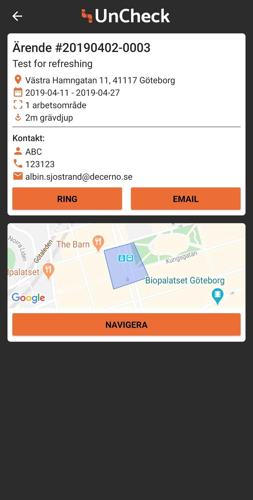
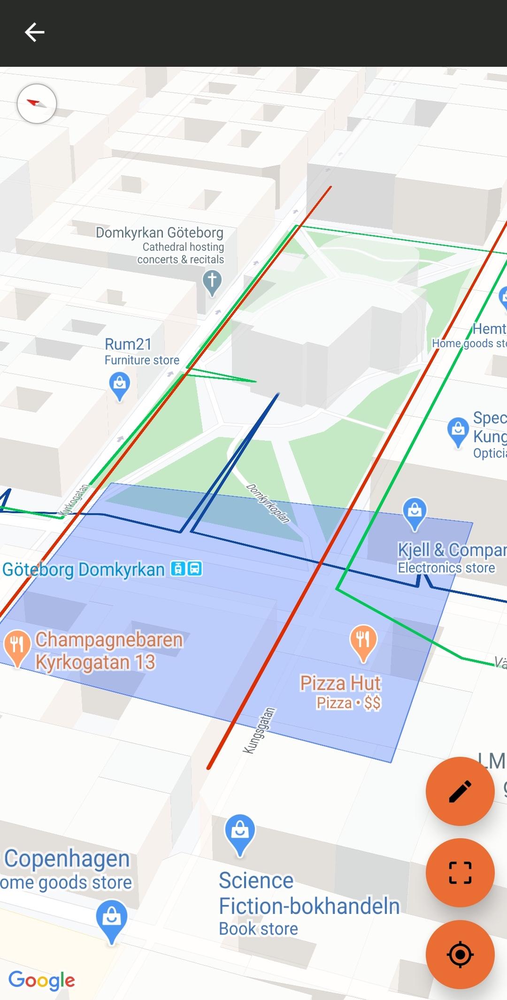

# Uncheck ✅

### Background
Application built as part of a bachelor thesis performed at Decerno AB. The intended users are construction workers tasked with marking where water pipes, electricity wiring and internet cables are routed under the ground. This is a fairly commonly performed task that has to be done in conjunction with any construction work so that we can avoid damaging any of the previously mentioned facilities. As stated by Decerno AB, the current way this task is performed is that the construction workers are provided with a printed out map of the site which they use as a basis to then pinpoint the exact location of the facilities using proper tooling. We try to improve this process by providing a digital alternative to the printed out map.

The goal of the project was to learn to evaluate React Native and GraphQL, the resulting thesis can be found [here](https://odr.chalmers.se/handle/20.500.12380/300615).

The name is a word play on a different service provided by Decerno AB.

Corresponding backend NodeJS+Apollo backend has been built as a part of this project it is not part of this repository.

## Tech stack
- iOS + Android with React Native
- Apollo GraphQL
- Google maps with react-native-maps

### Application Flow
- User is presented with a list of unmarked construction sites and their corresponding metadata
- User can select one of the listings for additional data and contact information with the customer
- User can then select the map view and is presented with a map displaying an overlay showing pipes, wiring and the work site.
- User can rotate and move around the map and use the action buttons to jump to their current location or back to the work site.
### Screenshots
 |  | 
